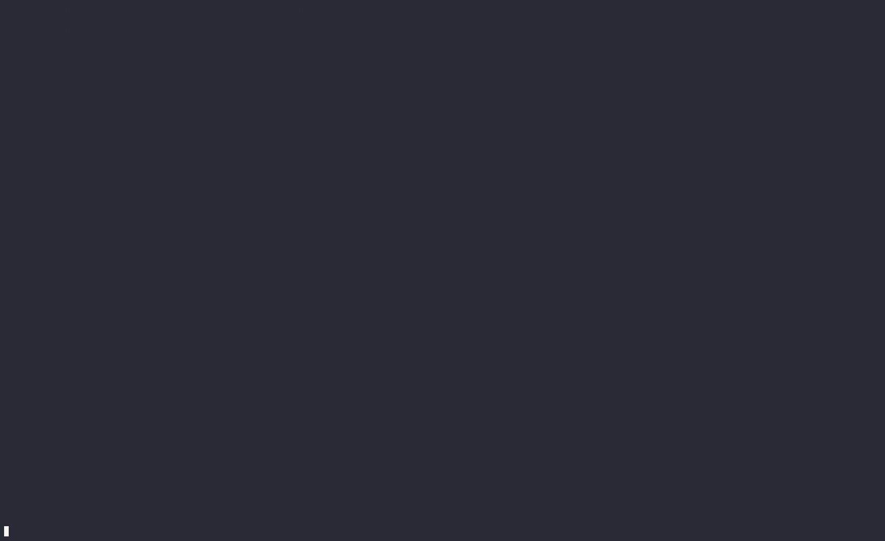

# Termdex


A Terminal Pokedex build using Rust and tui-rs

## Building

Building from source requires [Rust](https://www.rust-lang.org/) compiler
(1.67.1 or later) and [Cargo package manager](https://doc.rust-lang.org/cargo/).
You can install both with [rustup](https://rustup.rs/).

### Runing in Docker

If you have Docker and docker-compose
installed you can use it to run termdex in a container. This doesn't require Rust
toolchain or postgres installed on your machine.

Run termdex with the following command:

```sh
docker-compose run termdex
```
